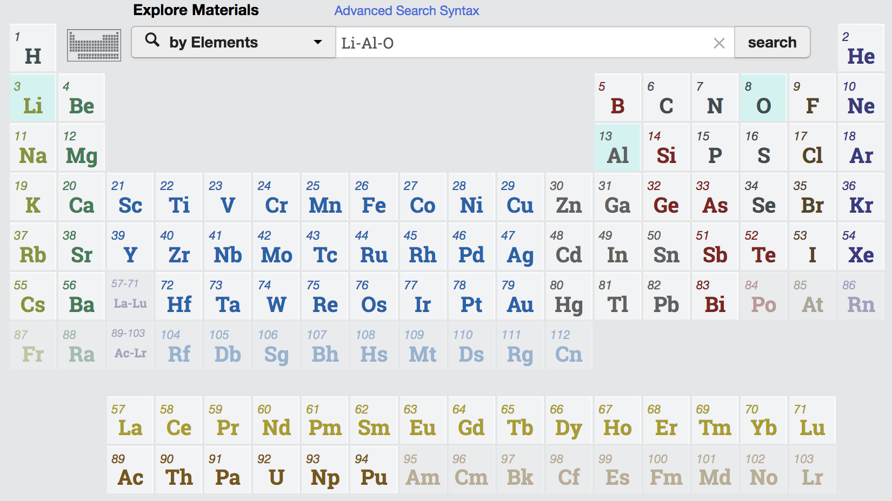
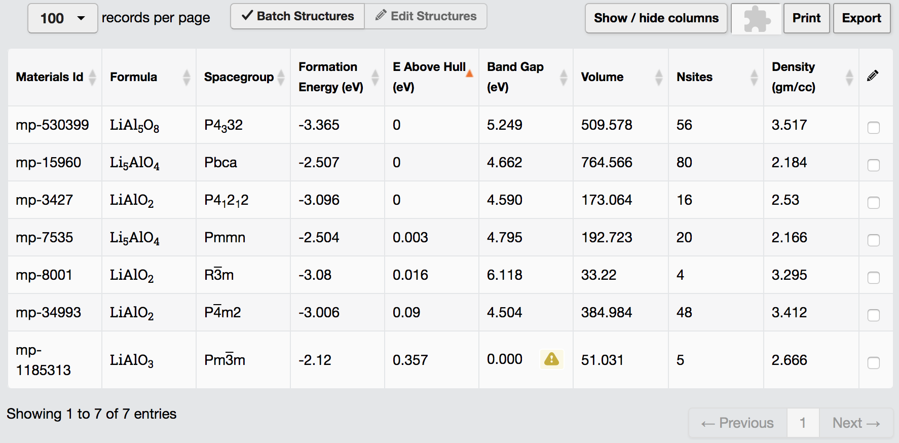
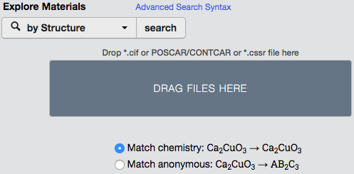

# Initial release of Materials Explorer.

In Materials Project we offer 5 options to explore materials: by elements, by formula, by IDs, by mpquery and by Structure.

# Key features

## By Elements

The following example is to show you how to query the materials by assigning the elements in the materials. Let's say
you want to find all the materials that contain Li, Al and O. In the search box, simply type `Li-Al-O` and search.
You would see the following searching results.

_Figure 1: Exploring materials that contain Li, Al and O._

## By formula

If you have a specific material in mind, you can also explore the materials by its formula. For example,
to search all the LaAlO3, change the search option to `by Formula` and type `LaAlO3`.

_Figure 2: Exploring all the LaAlO3 materials._

## By IDs

If you know the mp id of the material, you can search it by ID. You can also search multiple IDs
at the same time. Change the search option to `by IDs` and type the mp IDs that you are looking
for.

_Figure 3: Exploring specific materials by their mp IDs._

## By mpquery

In addition to the previous three basic explore options, Materials Project also provides an advanced
query option by mpquery, using Mongo-like language for flexible queries on the Materials Project
database. This provides the possibility of queries which would otherwise not be possible using
the other simpler REST forms. For example, to search all the iron oxides and manganese oxides,
change the search option to `by mpquery` and type `{'elements':{'$in':['Fe', 'Mn'], '$all': ['O']}, 'nelements':2}`.

_Figure 4: Exploring materials by using Mongo-like language for flexible queries._

## By Structure

Additionally, if you already have structure but need to know the materials properties, such as
band gap and formation energy, from the Materials Project database, you can change the search option
to `by Structure` and drag and drop your structure file in the grey box.

_Figure 4: Exploring materials by using Mongo-like language for flexible queries._
