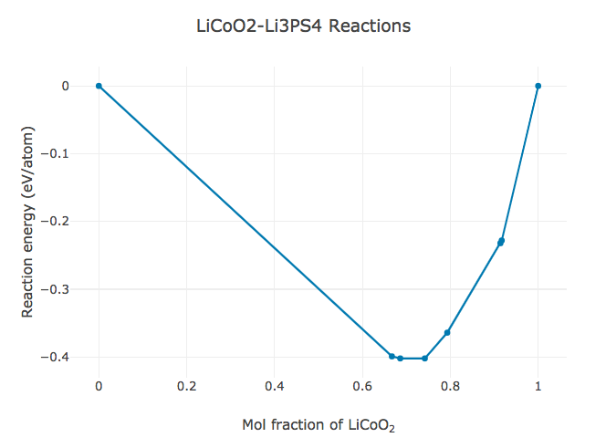
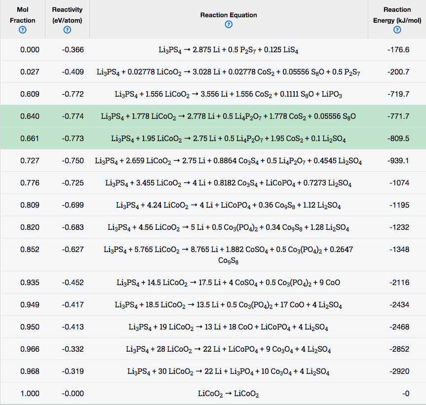

# Introduction

Interfaces between solid phases are critical in determining the optical, mechanical and transport properties of a system. Interfacial reactions can occur when two contacting materials are not thermodynamically stable against each other. Information about interface reactions is valuable in various aspects: the reaction energy reflects the reactivity of the interface, and the reaction products affect the performance of devices such as Li-ion batteries that are built from these materials. 

Experimental investigation of interface reactions is challenging as accessing the interface between two solids is difficult and the reaction layers have only limited thickness. It is thus highly valuable to predict possible interface reactions from a computational approach. 

Materials Project database provides calculated energies of a wide range of materials. By using all compounds in the relevant chemical system from Materials Project database, one can construct the reaction energy plots for the interface systems at 0 K and 0 atm.

The Manual outlines the usage of the Interface Reactions App and the computational methods employed.

## Using the Interface Reactions App

To construct the reaction energy plot for a closed system, enter the two reactants in contact into the fields “Reactant 1” and "Reactant 2" and click on “Compute” button.

In the case where the interface system is open to a particular element at a constant chemical potential (e.g., solid-state synthesis under constant $O_2$ gas flow), after entering the reactants, click on "Advanced options", and then check the "Open element?" box, select the element from the drop-down list, and enter the desired relative chemical potential. Note that the relative chemical potential of an element is referenced to the chemical potential of pure substance of that element. For example, for element Li the reference chemical potential is that of Li metal. Users can also use the slider bar to change the chemical potential for gaseous phases. For gaseous phases such as $O_2$, increasing temperature and/or decreasing the pressure leads to a lower chemical potential of the element.

As the plot is generated, it shows the reactivity (normalized reaction energy) of the interface as a function of molar fraction $x$of the first reactant. There are multiple ways to get the reaction information:

* When mousing over a node on the plot, the pop-up window shows the reactivity (eV/atom) and the reaction equation.
* You can zoom into a portion of the plot by defining a zoom area: click and hold at the upper-left corner of the desired area, and drag down and right, releasing the mouse at the lower-right corner of the desired area. The window should be replaced by the zoomed-in portion. To return to the original phase diagram, click on the “Autoscale” button in the tool bar at the upper-right corner.
* The reaction energy plot can be downloaded in PNG format by clicking on the first button in the tool bar at the upper-right corner.
* The table below the plot shows the detailed information of the reactions at critical molar fractions.

## Interpreting Reaction Energy Plots
The section shows how to interpret reaction energy plot generated by the Interface Reactions App. In the table below the plot, you can review, for each node in the plot, the corresponding quantities:

* **mol fraction**: The molar fraction of the first input reactant
* **reactivity (eV/atom)**: The reaction energy normalized to the total number of atoms in reactants. (For an open system, the element in the reservoir is excluded for the normalization.)
* **reaction equation**: A reaction equation chosen to normalize one of the reactants.
* **reaction energy (kJ/mol)**: The reaction energy (per mol) of the displayed reaction equation.

All input reactants are converted to reduced cell formulae in reaction equations. For example, the reactant $Li_2Co_2O_4$ will be converted to $LiCoO_2$.

### Reaction Plots in Closed Systems

*Figure 1. Calculated reaction energy plot for LiCoO2-Li3PS4 closed system*

To illustrate the reaction information generated by the Interface Reactions App, we use $LiCoO_2-Li_3PS_4$ system as an example. $LiCoO_2$ and $Li_3PS_4$ are commonly used cathode material and solid-state electrolyte material in Li-ion batteries, respectively. The cathode/electrolyte interface is of particular interest in battery research as it largely affects the battery performance. 

Figure 1 shows the reactivity as a function of molar fraction $x$ of $LiCoO_2$. Table 1 lists all the critical reaction equations, corresponding molar fraction of the first reactant and reaction energies per mole of reaction equation. There are 8 nodes in Figure 1 corresponding to 8 critical reactions. For example, the second node from the left with molar fraction of  $LiCoO_2$ being 0.667 corresponds to the reaction: 

$$Li_3PS_4 + 2 LiCoO_2 = 0.5 CoS_2 + 0.5 Co_3S_4 +  Li_3PO_4 +  Li_2S$$

The reactivity for this node is -0.399 eV/atom. The reaction energy of the reaction above is -616.0 kJ/mol. 

The largest reaction driving force (magnitude of reactivity) is found for two reactions with the molar fraction of $LiCoO_2$ being 0.686 and 0.742, respectively. The corresponding reactivity is -0.402 eV/atom.

*Table 1. Critical reaction information for LiCoO2-Li3PS4 closed system*

Since in reality the reaction between two phases can consume arbitrary amounts of either phase, the molar fraction in the mixed region is not necessarily the critical molar fraction in Table 1, but can be any value from 0 to 1. If the molar fraction is not exactly equal to the critical fraction, the reaction is a linear combination of the critical reactions for its left neighbor node and right neighbor node, by the lever rule. As a consequence, all reaction products in Table 1 are possible phases that may be generated at the interface.

### Reaction Plots in Open Systems

*Figure 2. Calculated reaction energy plot for LiCoO2-Li3PS4 system open to Li reservoir at relative chemical potential - 3 eV vs. Li metal.*

*Table 2. Critical reaction information for LiCoO2-Li3PS4 system open to Li reservoir at relative chemical potential - 3 eV vs. Li metal.*

We use the  $LiCoO_2-Li_3PS_4$ system that opens to Li reservoir to illustrate the reaction energy plot for an open system. The Li reservoir is at relative chemical potential - 3 eV vs. Li metal, corresponding to μ = -3 eV in the App. 

In Figure 2, there are 16 labeled nodes that corresponds to 16 critical reactions. The reaction energy at $x$ = 0 is negative, meaning that $Li_3PS_4$ is not stable at the given Li chemical potential. The corresponding decomposition reaction is:

$$Li_3PS_4 = 2.875 Li + 0.5 P_2S_7 + 0.125 LiS_4$$

The reaction equation shows that Li is extracted from the reactants to the Li reservoir during the decomposition of $Li_3PS_4$. In contrast, $LiCoO_2$ is stable at the given Li chemical potential as the reactivity is 0 eV/atom at $x$ = 1. The interpretation of other reactions in Table 2 is similar to those in the closed system. 

By comparing Table 1 and Table 2, it can be seen that the reaction products in the closed system and the open system for the same interface are quite different. This is because the stable materials in the closed system are not necessarily stable in the open system. Users can refer to Phase Diagram App to explore the phase diagrams of the corresponding systems.

## Thermodynamic Methodology
The Interface Reactions App uses the computed energies of materials from the Materials Project database. The computational methodology, default total energy corrections and accuracy can be found in the [https://materialsproject.org/docs/calculations Calculations Guide].

We consider two conditions for interface systems where chemical mixing occurs: 1) interfaces that are closed to any element (closed system), and 2) interfaces that are open to a particular element in the chemical system (open system). These two scenarios are treated separately as below:
 
### Chemical Mixing in Closed Systems
For closed systems, we calculate the reaction energy of two reactants A and B at varying mixing fraction $x$ of the first reactant using the equation:

$$\Delta E[A, B, x] = E_{pd} [x c_A + (1 - x) c_B] - x E_A - (1 - x) E_B$$

where $c_A$ and $c_B$ are the normalized compositions (i.e., the total number of atoms = 1) for reactants A and B, $E_A$ and $E_B$ are energies of ground-state structures for reactants A and B, respectively. $E_{pd}[c]$ is the energy on the energy convex hull at composition $c$. 

In the case where there is no structure in the database that matches the composition of reactant A or B, the energy on the convex hull $E_{pd}[c_A]$ or $E_{pd}[c_B]$ for that composition will be used instead. It should be noted that at endpoints (x = 0 or 1), the reaction energies can be zero or negative, depending on whether the ground-state structure energy of reactant A or B is on the hull or above the hull. In the generated reaction energy plot and the table, the App converts the mixing fraction $x$ to the corresponding molar fraction of the original first reactant for display.

### Chemical Mixing in Open Systems
In many applications, interface systems are open to a particular element at a constant chemical potential. For example, in battery conditions, the electrode/electrolyte interface is open to Li reservoir during battery cycling. The relevant thermodynamic potential for an open system is the grand potential Φ. For instance, for a system open to a Li reservoir at chemical potential $\mu_{Li}$, the grand potential for reactant with composition $c$ is obtained using the equation:

$\Phi[c, \mu_{Li}] = (E[c] - n_{Li}[c] \mu_{Li})/n_{non-Li}[c] $

where $E[c]$ is the energy of the ground-state structure that has composition $c$. $n_{Li}[c]$ and $n_{non-Li}[c]$ are the number of Li and non-Li atoms in composition formula $c$, respectively. PV and TS terms are ignored when calculating Φ. Because the system is open to Li, the grand potential is normalized by the number of non-Li atoms. The convex hull of $\Phi$ is constructed using the grand potentials of all phases in the chemical system. As a result, the grand potential on the grand potential convex hull $\Phi_{pd}$ is a function of composition $c$ and chemical potential $\mu_{Li}$ of the reservoir:

$$\Phi_{pd}[c, \mu_{Li}] = \min_{c_{Li}}{\{(E_{pd}[c+c_{Li}] - n_{Li}[c+c_{Li}] \mu_{Li}) / n_{non-Li}[c]\}}$$

where $c_{Li}$ is the number of Li atoms extracted from or added to the Li reservoir and therefore can take positive or negative value.

The reaction energy is calculated using: 

$$\Delta \Phi[A, B, \mu_{Li}, x] = \Phi_{pd}[xc_A + (1 - x) c_B, \mu_{Li}] - x \Phi[c_A, \mu_{Li}] - (1 - x) \Phi[c_B, \mu_{Li}]$$

##
Since the Interface Reactions App is based on the analysis of the energy convex hull, compounds that are metastable at 0 K will not show up in the reaction products, although they might be stable or kinetically stabilized under experimental conditions. Therefore, reactions not listed in the table are possible to happen under experimental conditions.

##
To cite the Interface Reactions App, please reference the following work:
* W. D. Richards, L. J. Miara, Y. Wang, J. C. Kim, and G. Ceder., Interface Stability in Solid-State Batteries, Chemistry of Materials, vol. 28, 2016, pp. 266–273. 

Note that the methodology used in this paper is slightly different from the one employed in the Interface Reactions App. In the paper, the energies for reactants are always the energies on the convex hull at the compositions of reactants, whereas in the Interface Reactions App the default reactant energies are the energies of corresponding ground-state structures. Only when no structure in the database matches the reactant composition will the energy on the convex hull be used. Users can restore the methodology used in the paper by additionally checking the "Always use hull energies?" box in the "Advanced options".

## Authors
Yihan Xiao
